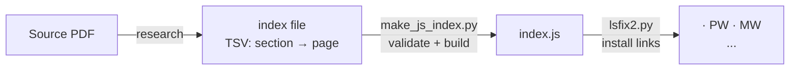

# Repo Documentation & Issue Cleanup Runbook

This file is an instruction set for Claude Code operating **autonomously** on a Sanskrit Lexicon repository. It covers the complete documentation and issue-organisation pass that was first applied to the PWG repo in 2026.

---

## Autonomy Rules

- Execute all steps below **without asking for user confirmation** unless the step is marked **[ASK]**.
- Batch all **[ASK]** items and ask at most once per hour.
- All GitHub API calls, file edits, git commits, and pushes may be executed freely.
- If a step fails transiently (5xx, timeout), retry once before continuing.
- Prefer batching API calls with loops over one-by-one manual steps.
- **Windows encoding**: all Python scripts must include `sys.stdout.reconfigure(encoding='utf-8')` and pass `encoding='utf-8'` to `subprocess.run`. Write multi-step scripts to a `.py` file rather than running inline.
- **Background execution**: for batches of 100+ API calls, write the script to a file, run it in background (`python script.py > script.log 2>&1 &`), then monitor with `until grep -q "DONE\|ERRORS" script.log; do sleep 10; done`.

---

## 0. Setup

Set these variables at the start and use them throughout:

```
ORG=sanskrit-lexicon
REPO=<target repo name, e.g. MWS>
```

Verify the repo is accessible:

```sh
gh api repos/$ORG/$REPO --jq '{name,description,has_issues}'
```

---

## Phase 1 — Audit current state

Fetch all issues (open + closed):

```sh
gh api "repos/$ORG/$REPO/issues?state=all&per_page=100&page=1" \
  --jq '[.[] | {n:.number,state:.state,labels:[.labels[].name],milestone:.milestone.title}]'
# repeat for page=2, page=3 … until an empty array is returned
```

For each issue, record:
- Has a **type label** (see Phase 3 for the list)
- Has a **severity label** (`minor`, `medium`, `hard`)
- Has a **milestone** (one of the four standard ones — see Phase 4)
- Is in a **project** (see Phase 6)

Also fetch existing labels and milestones:

```sh
gh api repos/$ORG/$REPO/labels --jq '[.[].name]'
gh api repos/$ORG/$REPO/milestones --jq '[.[] | {n:.number,title}]'
```

**Skip list — auto-detect, then optionally confirm.** Before asking the user, automatically identify candidate noise issues: issues whose title starts with "test", "admin", "note", or "meta"; issues that have zero labels AND zero comments AND have been open for 5+ years; issues marked with GitHub's built-in `invalid` or `duplicate` labels. Surface the candidate list in the [ASK] message but proceed with the rest of the audit in parallel — do not block on the answer. Default: process all issues unless the user explicitly confirms a skip list. For PWG the confirmed skip list was `{89, 99}`.

---

## Phase 2 — Create labels

Create any of the following that are missing. Existing labels with the same name must not be duplicated.

### Type labels — color `#0075ca`

```sh
for label in link-target link-splitting markup text-correction \
             content-enhancement encoding scan-quality bug question; do
  gh api repos/$ORG/$REPO/labels -X POST -f name="$label" -f color="0075ca" 2>/dev/null || true
done
```

### Severity labels

```sh
gh api repos/$ORG/$REPO/labels -X POST -f name="minor"  -f color="e4e669" 2>/dev/null || true
gh api repos/$ORG/$REPO/labels -X POST -f name="medium" -f color="fbca04" 2>/dev/null || true
gh api repos/$ORG/$REPO/labels -X POST -f name="hard"   -f color="d93f0b" 2>/dev/null || true
```

### Correct colors for pre-existing labels

GitHub ships repos with default labels (`bug`, `question`, `enhancement`, etc.) in different colors. After creating, update the color of any taxonomy label that already existed to ensure consistency:

```sh
for label in link-target link-splitting markup text-correction \
             content-enhancement encoding scan-quality bug question; do
  gh api repos/$ORG/$REPO/labels/$label -X PATCH -f color="0075ca" 2>/dev/null || true
done
```

---

## Phase 3 — Type label assignment rules

Every non-skipped issue must carry **exactly one** type label.

### Handling pre-existing GitHub default labels

Many repos start with GitHub's built-in labels (`bug`, `enhancement`, `question`, `wontfix`, `help wanted`, `good first issue`, `invalid`, `duplicate`). Several of these (`bug`, `question`) overlap with taxonomy names but were applied loosely. **Rule: the taxonomy label you assign wins.** After adding the correct type label, if the issue also carries a conflicting pre-existing label of a *different* type name, remove the old one:

```sh
# Remove a stale label after assigning the correct type
gh api repos/$ORG/$REPO/issues/$N/labels/<old-label> -X DELETE
```

Do not remove GitHub defaults that are not type conflicts (e.g., keep `invalid`, `duplicate`, `wontfix` — they carry status meaning, not type meaning).

| Label | When to apply |
|---|---|
| `link-target` | Building a click-through from a `<ls>` abbreviation to scanned PDF pages: researching the source, constructing an index, installing links across all related dictionaries |
| `link-splitting` | Splitting combined `SOURCE N,N` refs that resolve to a single target into individual per-page links |
| `markup` | Normalising XML tag content or structure (`<ls>`, `<lex>`, and similar) |
| `text-correction` | Corrections to German definitions or Sanskrit headwords in the dictionary text |
| `content-enhancement` | New material, display upgrades, or structural additions that go beyond correction |
| `encoding` | SLP1/AS/IAST transcoding, character rendering (Greek, accents), hyphen/dash normalisation |
| `scan-quality` | Replacing blurry, skewed, or missing scan pages with clearer images |
| `bug` | Broken links, XML structure errors, broken download files, page-number bugs |
| `question` | Scholarly or editorial questions requiring research before any code change |

To assign a type label:

```sh
gh api repos/$ORG/$REPO/issues/$N/labels -X POST -f labels[]="<type>"
```

---

## Phase 4 — Severity label assignment rules

Every non-skipped issue must carry **exactly one** severity label.

| Label | When to apply |
|---|---|
| `minor` | Targeted, self-contained fix — a handful of lines or a single file. Typical for: markup, encoding, bug, question, scan-quality |
| `medium` | Standard unit of work — one link-target index, a batch of markup corrections, a moderate content addition. Typical for: link-target, link-splitting, content-enhancement |
| `hard` | Large, complex effort spanning many sources, files, or dictionaries |

Default heuristics when in doubt:
- `link-target` → `medium`
- `link-splitting` (single source) → `medium`
- `link-splitting` (10+ sources in one issue) → `hard`
- `markup`, `encoding`, `bug`, `question`, `scan-quality` → `minor`
- `content-enhancement` → `medium` (use `hard` only for very large additions)
- `text-correction` → `minor`

---

## Phase 5 — Milestone setup

Create the four standard milestones if they do not already exist:

```sh
for title in "Dictionary to Book" "Digitization Quality" "Structured Data" "Major Enhancements"; do
  gh api repos/$ORG/$REPO/milestones -X POST -f title="$title" 2>/dev/null || true
done
```

Note the assigned milestone numbers — they may not be 1–4 if the repo already had milestones (MWS had 1–4 taken by month labels, so the four standard milestones were numbered 5–8):

```sh
gh api repos/$ORG/$REPO/milestones --jq '[.[] | {n:.number,title}]'
```

Build a `ms_map` dictionary keyed on title (not number) during the audit script, then look up the correct number at assignment time. Never hardcode milestone numbers across repos.

### Milestone assignment by type label

| Milestone | Type labels that belong here |
|---|---|
| Dictionary to Book | `link-target`, `link-splitting` |
| Digitization Quality | `scan-quality`, `encoding`, `bug`, `text-correction` |
| Structured Data | `markup`, `question` |
| Major Enhancements | `content-enhancement` |

For issues with two type labels, assign to the milestone of the **dominant** type (the one that describes the primary work). Use this priority order when both types could apply: `link-target` > `link-splitting` > `content-enhancement` > `markup` > `text-correction` > `encoding` > `bug` > `scan-quality` > `question`. If genuinely unclear after applying priority, **[ASK]**.

To assign a milestone:

```sh
gh api repos/$ORG/$REPO/issues/$N -X PATCH -f milestone=<milestone_number>
```

---

## Phase 6 — GitHub Projects setup

Four org-level Projects V2 (kanban boards) mirror the four milestones. Check if they already exist:

```sh
gh api graphql -f query='{ organization(login: "sanskrit-lexicon") {
  projectsV2(first: 20) { nodes { id number title } } } }'
```

If the four projects do not exist, **[ASK]** the user to create them (project creation requires owner permissions that may not be available via API). Provide the user with the four names: **Dictionary to Book**, **Digitization Quality**, **Structured Data**, **Major Enhancements**.

Once project IDs are known, add every issue to the project that matches its milestone:

```python
# Pseudocode — adapt to Python with subprocess + gh api graphql
for issue_number, milestone_title in all_issues:
    project_id = milestone_to_project_id[milestone_title]
    node_id = get_issue_node_id(issue_number)
    graphql_mutation_add_item(project_id, node_id)
```

GraphQL mutation:

```graphql
mutation {
  addProjectV2ItemById(input: {
    projectId: "<project_node_id>"
    contentId: "<issue_node_id>"
  }) { item { id } }
}
```

Fetch issue node IDs in bulk (100 per page):

```sh
gh api "repos/$ORG/$REPO/issues?state=all&per_page=100&page=N" \
  --jq '[.[] | {n:.number, id:.node_id}]'
```

---

## Phase 7 — Verification

Re-fetch all issues and run this check:

```python
import subprocess, json, sys
sys.stdout.reconfigure(encoding='utf-8')

# Build ms_map from milestone API response keyed on milestone NUMBER
# type_labels and sev_labels sets as defined above

missing_type = missing_sev = missing_ms = multi_type = wrong_ms = 0
for iss in all_issues:
    lbls = set(iss['labels'])
    t = lbls & type_labels
    if not t:                   missing_type += 1
    if not (lbls & sev_labels): missing_sev  += 1
    if not iss['milestone']:    missing_ms   += 1
    if len(t) > 1:              multi_type   += 1
    # wrong milestone: only flag when exactly one type label
    if len(t) == 1 and iss['milestone']:
        expected = ms_map.get(next(iter(t)))
        if expected and iss['milestone'] != expected:
            wrong_ms += 1
            print(f"  wrong ms #{iss['n']}: has {iss['milestone']}, expected {expected}")
```

All five counters must reach 0. A non-zero `multi_type` means stale labels were not fully cleaned (see Phase 3 pre-existing label rule). Fix all gaps before proceeding.

### Verifying project membership via GraphQL

```sh
gh api graphql -f query='{ node(id: "<PROJECT_NODE_ID>") {
  ... on ProjectV2 {
    items(first: 100) { nodes { content { ... on Issue { number } } } }
  } } }'
```

Cross-check the returned issue numbers against your full list. Any issue absent from all four projects is a gap.

---

## Phase 8 — CLAUDE.md

Create or update `CLAUDE.md` in the repository root. Adapt the PWG version at `https://github.com/sanskrit-lexicon/PWG/blob/master/CLAUDE.md` to the target repo:

- Replace PWG-specific commands, directory names, and pipeline descriptions with the target repo's equivalents.
- Keep the **GitHub Issue Conventions** section verbatim (milestones, type labels, severity labels are the same across all Sanskrit Lexicon repos).
- Fetch the target repo's directory structure and key scripts to fill in the architecture section.

Commit: `CLAUDE.md: initial guidance for Claude Code`

---

## Phase 9 — README.md

Create or update `README.md`. The structure should follow the PWG readme as a template. Adapt each section:

### Required sections (in order)

1. **Title + one-paragraph description** — what the repo contains, its place in the Sanskrit Lexicon project, primary input file and sibling repos.

2. **Directories table** — one row per top-level directory with a short description. Derive from `ls` of the repo.

3. **How It Works** — correction workflow (change files + `updateByLine.py` if applicable), issue workflow, link-target workflow with Mermaid flowchart:



4. **Project Timeline** — table of `Period | Work`, one row per year of activity. Derive from git log and issue dates.

5. **Projects & Milestones** — table with live counts fetched from the API, plus two Mermaid pie charts:


6. **Issue Typology** — two subsections (Solved / Open), each a table with columns Type | Description | Examples. Include live counts per type in each description. Add a Mermaid pie chart of all issues by type:


7. **Labels** — copy verbatim from the PWG readme Labels section (type and severity tables are the same across repos).

8. **Contributors** — list contributors with GitHub handles and roles. Derive from git log authors and issue participants.

### Counts

All counts in the readme must be fetched live from the API immediately before the final commit — do not hard-code stale numbers.

### Mermaid validation

Before committing, validate each Mermaid block via the GitHub markdown render API:

```sh
gh api markdown -X POST \
  -f text="$(cat <<'EOF'
\`\`\`mermaid
<diagram content>
\`\`\`
EOF
)" -f mode="markdown"
```

A rendered diagram is confirmed when the response contains `highlight-source-mermaid` **with syntax-highlighting span classes** (`pl-k`, `pl-ent`, `pl-s`, etc.) on the diagram keywords. Plain unstyled text inside the block means the diagram type is not supported — replace it with a supported type (`pie`, `flowchart`, `graph`, `sequenceDiagram`, `gantt`). Do **not** use `xychart-beta` — it is not supported on GitHub.

---

## Phase 10 — Final commit and push

```sh
git add README.md CLAUDE.md
git commit -m "docs: initial README and CLAUDE.md; full issue triage (labels, milestones, projects)"
git push
```

---

## Checklist

- [ ] All issues have exactly one type label (`multi_type == 0`)
- [ ] All issues have a severity label
- [ ] All issues have a milestone
- [ ] All issues are in exactly one project
- [ ] Each issue's project matches its milestone
- [ ] No pre-existing conflicting labels remain (stale `bug`/`question` defaults removed)
- [ ] Label colors updated to taxonomy palette (`0075ca` / `e4e669` / `fbca04` / `d93f0b`)
- [ ] `CLAUDE.md` committed
- [ ] `README.md` committed with live counts
- [ ] All Mermaid diagrams validated via GitHub API (confirmed `highlight-source-mermaid` spans)
- [ ] Changes pushed to `origin/master`

## Lessons Learned (from MWS application)

- **Milestone numbers are not portable.** MWS had pre-existing milestones 1–4, so the four standard ones were assigned 5–8. Always discover numbers from the API; never hardcode.
- **GitHub default labels collide with taxonomy.** `bug` and `question` are GitHub's built-in defaults, applied loosely on many repos before taxonomy exists. After assigning the correct type, explicitly delete the conflicting old label.
- **Wrong-milestone false positives.** If the verification script finds type labels with a set operation (e.g., `set.intersection`), a multi-type issue returns whichever type Python picks first, which may not match the milestone. Fix: resolve multi-type before verifying, or check `len(type_labels_found) == 1` before asserting milestone correctness.
- **Windows cp1251 breaks on Sanskrit/Unicode output.** Any `subprocess` call that reads `gh api` output containing accents, Devanagari, or special chars will crash unless `encoding='utf-8'` is passed to `subprocess.run` and `sys.stdout.reconfigure(encoding='utf-8')` is set at script start.
- **`xychart-beta` is not rendered on GitHub.** Use `pie` for all distribution/count charts. Validate every Mermaid block via `gh api markdown` and check for `pl-k` spans, not just `highlight-source-mermaid`.
