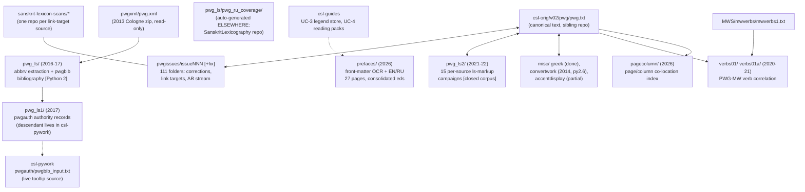

# PWG pipelines — operator manual

_Created: 28-07-2026 · Last updated: 28-07-2026_

This is the **operator manual** for the PWG repository: how to run, verify, and
extend its correction, link-target, abbreviation, bibliography, preface and
index pipelines without spelunking the ~900 Python files first. PWG is not one
pipeline — it is ~140 issue/workspace folders over **one shared idiom**
(snapshot → change files → `updateByLine.py` → regenerate → XML-validate →
batched delivery), and this manual is organised around that idiom.

Three documents describe this repo, with different jobs:

- **What the repo is** (history, timeline, issue taxonomy, contributors) —
  [readme.md](https://github.com/sanskrit-lexicon/PWG/blob/main/readme.md);
- **Code contract for AI/code sessions** (directory map, key commands) —
  [CLAUDE.md](https://github.com/sanskrit-lexicon/PWG/blob/main/CLAUDE.md);
- **How to operate the pipelines** (this document) —
  [docs/PIPELINE_MANUAL.md](https://github.com/sanskrit-lexicon/PWG/blob/main/docs/PIPELINE_MANUAL.md).

[RUNBOOK.md](https://github.com/sanskrit-lexicon/PWG/blob/main/RUNBOOK.md) is
**not** a pipeline manual — it is the org's issue-taxonomy / documentation
cleanup autonomy script (labels, milestones, projects), first applied to PWG in
2026. For pipelines, you are in the right place.

Command sequences below are quoted **verbatim from the in-repo `readme` notes**
of each workspace (the same logs the original operators kept); paths were
verified to exist in the tree on 28-07-2026. A full end-to-end re-run was not
attempted — several pipelines are one-time-historical and the readme install
steps overwrite the sibling `csl-orig` working tree (see the
[lifecycle table](#lifecycle--which-pipelines-are-live)).

The universal 8-stage csl-orig correction procedure is documented once,
canonically, in
[csl-corrections/docs/correction-workflow.md](https://github.com/sanskrit-lexicon/csl-corrections/blob/main/docs/correction-workflow.md)
and
[csl-orig/docs/CORRECTION_MANUAL.md](https://github.com/sanskrit-lexicon/csl-orig/blob/main/docs/CORRECTION_MANUAL.md)
— this manual does not repeat it; it documents what is **PWG-specific**.

## The two base files — read this first

PWG tooling operates on **two different base files across its history, and they
are not interchangeable**:

| Base file | Who uses it | Access |
|---|---|---|
| `../pwgxml/pwg.xml` — sibling checkout, fetched from a Cologne zip (see [CLAUDE.md](https://github.com/sanskrit-lexicon/PWG/blob/main/CLAUDE.md)) | Round-1 extraction archaeology only: [pwg_ls/pwg_dhaval/](https://github.com/sanskrit-lexicon/PWG/tree/main/pwg_ls/pwg_dhaval) (`abbrv0.py`, `pwgls.py`) | **read-only** (lxml parse); nothing in this repo ever writes to pwgxml |
| `csl-orig/v02/pwg/pwg.txt` — the canonical digitization in the sibling [csl-orig](https://github.com/sanskrit-lexicon/csl-orig) repo | Everything else: `pwgissues/`, `pwg_ls2/`, `misc/greek/`, the AB stream | snapshot out via `git show <commit>:v02/pwg/pwg.txt`, patch the snapshot, validate, deliver |

`updateByLine.py` is **never** run against `pwg.xml` anywhere in this repo — it
is a line-numbered *text* transformer and only ever operates on `pwg.txt`
snapshots. The XML served by Cologne is *regenerated* from `pwg.txt` by
`generate_dict.sh`, never hand-edited.

## Cheat-sheet: the universal correction loop

Every live workflow in this repo is an instance of this loop. Historical
readmes assume the two-root XAMPP layout (see
[Environment](#environment-and-prerequisites)); `$ORIG` =
`csl-orig/v02/pwg/pwg.txt`, `$PYWORK` = `csl-pywork/v02`.

```sh
# 0. Snapshot the canonical text, pinned to a commit (record the hash in your readme)
git -C <csl-orig> show <commit>:v02/pwg/pwg.txt > temp_pwg_0.txt

# 1. Produce a change file (three ways)
#    a. a generator script (lsfix2.py + dict_replace2.py, make_change*.py, stepN.py ...)
#    b. hand-edit a copy, then diff:
python diff_to_changes_dict.py temp_pwg_0.txt temp_pwg_1.txt change_pwg_1.txt
#    c. write it by hand (small fixes)

# 2. Apply it — the universal transaction tool
python updateByLine.py temp_pwg_0.txt change_pwg_1.txt temp_pwg_1.txt

# 3. Validate: copy into csl-orig, regenerate, XML-check, RESTORE
cp temp_pwg_1.txt $ORIG
cd $PYWORK
sh generate_dict.sh pwg  ../../pwg
sh xmlchk_xampp.sh pwg            # expect "ok"
git -C <csl-orig> restore v02/pwg/pwg.txt   # if this was only a validation run

# 4. Deliver — NEVER push to csl-orig directly (see Delivery below)
```

**The change-file format** (UTF-8, paired lines, `;` = comment; line numbers
are 1-based positions in the INPUT file), from the canonical spec in
[pwg_ls2/01/updateByLine.py](https://github.com/sanskrit-lexicon/PWG/blob/main/pwg_ls2/01/updateByLine.py)'s
docstring:

```
NNN old <exact current text of line NNN>
NNN new <replacement text>
```

`updateByLine.py` also supports `ins` (insert after line NNN) and `del`
(delete). It aborts on the slightest `old`-text mismatch — that strictness is
the safety property, not a bug. Because `ins`/`del` shift line numbers, the
house style is one concern per change file and a numbered temp chain
(`temp_pwg_0 → temp_pwg_1 → ...`). Two accumulation idioms coexist:

- **pwgissues style** (e.g. issue98fix): each pass applies a new change file to
  the *previous* temp (`temp_pwg_1 → temp_pwg_2`); change-file line numbers are
  relative to their own input temp.
- **pwg_ls2 style** (e.g. spruch): one growing `change_01.txt` is always
  re-applied to the *pristine* `temp_pwg_00.txt`. Do not mix the two idioms in
  one folder.

## Map of the workspaces



### Lifecycle — which pipelines are live

| Workspace | What it is | Status |
|---|---|---|
| [pwgissues/](https://github.com/sanskrit-lexicon/PWG/tree/main/pwgissues) | one folder per GitHub issue (111 folders, #48–#193); correction + link-target + AB workflows | **Live pattern** — every new issue gets a folder; index: [pwgissues/readme.txt](https://github.com/sanskrit-lexicon/PWG/blob/main/pwgissues/readme.txt) |
| [pwgissues/issue174→191](https://github.com/sanskrit-lexicon/PWG/tree/main/pwgissues/issue191) | the 2026 Andhrabharati (AB) v1e reconciliation stream | **Live, plateaued** — v1e installed in csl-orig; residue forked into per-tag issues (#186 tooltips, #188 `lang`, #193 `ls n` audit) |
| [prefaces/](https://github.com/sanskrit-lexicon/PWG/tree/main/prefaces) | front-matter OCR + EN/RU translations, per-page + consolidated | **Live** — see Walkthrough 5; consumed by csl-guides UC-3/UC-4 |
| [pagecolumn/](https://github.com/sanskrit-lexicon/PWG/tree/main/pagecolumn) | page/column co-location index over entry headers | **Re-runnable** (2026); derived `.tsv` git-ignored |
| [pwg_ls/pwg_ru_coverage/](https://github.com/sanskrit-lexicon/PWG/tree/main/pwg_ls/pwg_ru_coverage) | RU-translation citation coverage stats | **Auto-generated elsewhere** on a schedule — do not edit by hand; generator is `RussianTranslation/src/build_citation_index.py` in [SanskritLexicography](https://github.com/gasyoun/SanskritLexicography) |
| [pwg_ls2/](https://github.com/sanskrit-lexicon/PWG/tree/main/pwg_ls2) | 15 per-source `<ls>`-markup campaigns (2021–22) | **Closed corpus** — change files pinned to frozen csl-orig commits; methodology exemplar, not a runnable tool |
| [pwg_ls/](https://github.com/sanskrit-lexicon/PWG/tree/main/pwg_ls) | Round-1 `<ls>` extraction + pwgbib bibliography (2016–17) | **Frozen, Python 2** — `makeabbrv.sh` broken (see landmines); data outputs still consumed |
| [pwg_ls1/](https://github.com/sanskrit-lexicon/PWG/tree/main/pwg_ls1) | Round-2 authority/bibliography records (2017) | **Superseded in place** — its descendant `pwgbib_input.txt` lives in csl-pywork and is the live tooltip source |
| [verbs01/](https://github.com/sanskrit-lexicon/PWG/tree/main/verbs01) → [verbs01a/](https://github.com/sanskrit-lexicon/PWG/tree/main/verbs01a) | verb/upasarga identification correlated with MW | Frozen (2020/2021); verbs01a supersedes verbs01 but cannot re-run standalone (external inputs) |
| [misc/greek/](https://github.com/sanskrit-lexicon/PWG/tree/main/misc/greek) | single-Greek-letter + punctuation markup fix | Done, shipped ("OK as hoped!"); proof file committed |
| [misc/convertwork/](https://github.com/sanskrit-lexicon/PWG/tree/main/misc/convertwork) | the 2014 HK→SLP1 conversion of the whole digitization | One-time historical, **Python 2.6**, inputs not in repo — do not re-run |
| [misc/accentdisplay/](https://github.com/sanskrit-lexicon/PWG/tree/main/misc/accentdisplay) | Vedic-accent glyph rendering test-bench | Partial — `example2` never built; bottom of its readme is foreign notes (landmine №8) |
| [RussianWords/](https://github.com/sanskrit-lexicon/PWG/tree/main/RussianWords) | Russian etymologies dropped by the digitization | Frozen 2016 evidence dump — PNGs are the authority; the txt's Cyrillic is itself garbled |
| [pwgheader/](https://github.com/sanskrit-lexicon/PWG/tree/main/pwgheader) | header lines stripped from Malten's digitization + AB VN PDFs | Frozen 2021 record; its script (`pwgall.py`) lives on the Cologne server, Python 2.6 |
| `deepseek_pilot/` | four-track LLM pilot over the ja-slice | **Branch-only** ([deepseek-pilot](https://github.com/sanskrit-lexicon/PWG/tree/deepseek-pilot)), paused mid-scale-up; not on main |

## Environment and prerequisites

- **Python 3** for `pwgissues/`, `pwg_ls2/`, `misc/greek/`, `pagecolumn/`,
  `prefaces/build_combined.py`. **Python 2 only** (will `SyntaxError` on py3):
  everything under `pwg_ls/` and `pwg_ls1/`; `misc/convertwork/` is
  Python 2.6 by name (`python26`). `lxml` is needed only by the Round-1
  extraction (`abbrv0.py`); PHP only by the (missing) `displayhtml.php` step.
- **Sibling checkouts.** The readmes assume the historical two-root XAMPP
  layout: `/c/xampp/htdocs/sanskrit-lexicon/PWG` beside
  `/c/xampp/htdocs/cologne/{csl-orig, csl-pywork, csl-websanlexicon,
  csl-apidev}`. On a current flat checkout (everything under one `GitHub/`
  dir) the remapping is mechanical — `cologne/csl-orig` → sibling `csl-orig`,
  etc. **The absolute `/c/xampp/...` paths inside the readmes are not literal
  on a modern host** — only the relative structure matters. (One readme even
  writes the repo as lowercase `pwg`.)
- **The five-kosha blast radius.** PWG link-target and splitting issues
  routinely patch **five** dictionaries in one pass — pwg, pw, pwkvn, sch, mw
  — because they share the Petersburg source citations. Expect
  `temp_<kosha>_N.txt` chains and per-kosha `readme_<kosha>.txt` files in a
  fix folder.
- **Scan viewers are separate repos.** Each researched source gets its own
  repo under the [sanskrit-lexicon-scans](https://github.com/sanskrit-lexicon-scans)
  org (e.g. `rajatarcalc`), hosting the PDF page apps that `index.js` drives.
- No secrets, no network access — except the pwgxml bootstrap
  (`curl` of the 2013 Cologne `pwgxml.zip`, URL health not guaranteed) and the
  preface scan mirrors.

## Delivery — the batched-PR rule (read before installing anything)

Historical readmes in this repo end with `cd csl-orig; git add .; git commit;
git push` — that was the upstream maintainers' pattern (Jim/Dhaval). **Agent
and operator sessions today must not do that.** Per the org rule and the
canonical
[correction workflow](https://github.com/sanskrit-lexicon/csl-corrections/blob/main/docs/correction-workflow.md):
prepare and XML-validate locally, park each correction in the queue
(`/cologne-correction-queue`), and ship everything as **one consolidated PR to
csl-orig at most ~monthly** (`/cologne-batch-pr`). The change files committed
in this repo are the audit trail, not the delivery vehicle.

## Walkthrough 1 — a correction issue (`pwgissues/issueNNN/`)

The live pattern for any new correction. Model folders:
[issue98fix](https://github.com/sanskrit-lexicon/PWG/tree/main/pwgissues/issue98fix)
(classic multi-kosha splitting, 2025) and
[issue190](https://github.com/sanskrit-lexicon/PWG/tree/main/pwgissues/issue190)
(modern staged pipeline, 2026, the best-documented folder in the tree). The
folder index with one-line purposes is
[pwgissues/readme.txt](https://github.com/sanskrit-lexicon/PWG/blob/main/pwgissues/readme.txt).

1. **Create `pwgissues/issueNNN/`**, copy in the standard toolkit from a
   recent folder: `updateByLine.py`, `diff_to_changes_dict.py`, `digentry.py`
   (97 copies across the tree — vendoring is the house style; credit the
   source folder inline, e.g. `# count_ab.py from issue180`).
2. **Snapshot, pinned** — record the csl-orig commit in your readme, as
   issue186 does (`# get temporary local copy of kosha (at commit c671ad1b9)`),
   or exactly: `git show <hash>:v02/pwg/pwg.txt > temp_pwg_0.txt`.
3. **Generate → apply change files** per the cheat-sheet loop, one numbered
   temp per pass. `temp_*.txt` are **gitignored working files**; only
   `change_*.txt`, logs and the readme are committed — the change files ARE
   the deliverable audit trail.
4. **Validate** with the borrow-and-return idiom (from
   [issue188](https://github.com/sanskrit-lexicon/PWG/tree/main/pwgissues/issue188)):

   ```sh
   cp temp_pwg_1.txt /c/xampp/htdocs/cologne/csl-orig/v02/pwg/pwg.txt
   cd /c/xampp/htdocs/cologne/csl-pywork/v02
   sh generate_dict.sh pwg  ../../pwg
   sh xmlchk_xampp.sh pwg
   cd /c/xampp/htdocs/cologne/csl-orig/
   git restore v02/pwg/pwg.txt
   ```

5. **Document** every command you actually ran in the folder's `readme.txt`,
   with its stdout pasted beneath it (the `# 183 lines changed` style is what
   makes this manual possible). The 2026 folders (issue173, issue190,
   issue193) switch to structured `readme.md` with step tables — prefer that
   format for new work; [issue190/README.md](https://github.com/sanskrit-lexicon/PWG/blob/main/pwgissues/issue190/README.md)
   (a per-step table: Script / Input / Output / Changes / What it does, plus a
   `redo.sh` that replays all eight steps) is the model.
6. **Deliver** per the batched-PR rule above.

A staged pipeline like issue190's is worth imitating for any bulk markup fix:
eight `stepN.py` scripts, each `temp_pwgN.txt → temp_pwg(N+1).txt` with a
recorded change count (8501 → 4856 → 1081 → 386 → 100 → 80 → 13 → 13), the
final step applying a hand-corrected `log1.txt` against a machine-produced
`log.txt` — the human-review residue made explicit.

## Walkthrough 2 — link targets (`pwgissues/`, two halves)

The decade-long flagship program: make every `<ls>` citation click through to
the scanned page. The canonical prototype is
[issue169](https://github.com/sanskrit-lexicon/PWG/tree/main/pwgissues/issue169)
(Rājataraṅgiṇī Calcutta ed., 2025 — [issue173](https://github.com/sanskrit-lexicon/PWG/tree/main/pwgissues/issue173)'s
readme names it as such); [issue168](https://github.com/sanskrit-lexicon/PWG/tree/main/pwgissues/issue168)
is the cleanest small (pwg-only) case;
[issue160](https://github.com/sanskrit-lexicon/PWG/tree/main/pwgissues/issue160)
is the umbrella tracker for the splitting program;
[issue94](https://github.com/sanskrit-lexicon/PWG/tree/main/pwgissues/issue94)
is the master link census (still refreshed).

### 2a. Research → index TSV → `index.js`

Research the source PDF's page structure into a TSV index (issue169's
`index.txt` columns: `page  taranga  from v.  to v.  ipage  Remarks`), then:

```sh
python make_js_index.py index.txt index.js
```

`make_js_index.py` validates internal consistency and reports the record
count; the stock readme description:

```
make_js_index.py makes index into a javascript module.
It does several validity checks.
This program will be part of the 'app1' in the sanskrit-lexicon-scans
repo for this link source.
```

Two generations coexist: the current **2-arg** form above (issue168/169/173)
and an older **3-arg per-volume** form (`python make_js_index.py I
yajn_index_v1a.txt index_1.js`) in issue62/75/87/98/100/... — check the main
block of the copy you vendored. `index.js` is consumed by the scan-viewer app
in the source's own [sanskrit-lexicon-scans](https://github.com/sanskrit-lexicon-scans)
repo and by `basicadjust.php` link resolution. Per issue173: the per-dictionary
`basicadjust.php` copies are **generated from the master template in a build
step** — edit the template in csl-websanlexicon, never the copies (and see
`/cologne-fork-sync-check` for the csl-apidev twin).

### 2b. Splitting non-standard refs (`lsfix2.py`)

`lsfix2.py` needs its two siblings `lsfix2_parm.py` (defines the
abbreviation-family codes) and `digentry.py` — always copy the trio. From
[issue98fix/readme_pwg.txt](https://github.com/sanskrit-lexicon/PWG/blob/main/pwgissues/issue98fix/readme_pwg.txt),
verbatim:

```sh
python lsfix2.py pwg temp_pwg_0.txt lsfix2_pwg_0.txt
# (False,3),(None,88),(True,3511),(fixed,182),(all,3784) lsfix2_pwg_0.txt

cp temp_pwg_0.txt temp_pwg_1.txt
# edit changes to temp_pwg_1.txt   (the None cases, by hand)

python lsfix2.py pwg temp_pwg_1.txt lsfix2_pwg_1.txt
# (None,9),(True,3586),(fixed,183),(all,3778) lsfix2_pwg_1.txt

# apply the 'fixed' rows mechanically
python dict_replace2.py temp_pwg_1.txt lsfix2_pwg_1.txt temp_pwg_2.txt
# apply_repls: 183 lines changed

# document
python diff_to_changes_dict.py temp_pwg_0.txt temp_pwg_1.txt change_pwg_1.txt
python diff_to_changes_dict.py temp_pwg_1.txt temp_pwg_2.txt change_pwg_2.txt
```

Read the tuple report as: `True` = already-standard refs, `None` = unresolved
(manual work), `fixed` = machine-replaceable, `False` = errors. Repeat per
kosha (`readme_pw.txt`, `readme_pwkvn.txt`, `readme_sch.txt`, `readme_mw.txt`)
— issue98fix's totals: pwg 484 additional standard links, pw 5, pwkvn 3,
sch 3, mw a few.

### 2c. Install surface

A link-target issue touches, beyond csl-orig: **csl-corrections** (change-file
audit), **csl-websanlexicon** (`basicadjust.php` template), **csl-apidev**
(the forked copy), plus display regeneration for all touched koshas
(`sh generate_dict.sh pwg ../../pwg` etc.). A plain correction issue touches
only csl-orig + csl-corrections (+ csl-pywork when tooltips change). Delivery
still follows the batched-PR rule — the per-repo `git push` blocks in the
readmes are the historical maintainer pattern.

## Walkthrough 3 — the Andhrabharati (AB) reconciliation stream (2026)

The newest major program: reconciling Nagabhushana Rao's independent
digitization of PWG against the Cologne text. Chain:
[issue174](https://github.com/sanskrit-lexicon/PWG/tree/main/pwgissues/issue174)
(`<ab>` markup census, introduces `count_ab.py`/`abdiff.py`) →
[issue178](https://github.com/sanskrit-lexicon/PWG/tree/main/pwgissues/issue178)
(continuation) →
[issue180](https://github.com/sanskrit-lexicon/PWG/tree/main/pwgissues/issue180)
(the big one: aligns AB's v1a/v1b/v1c files with the CDSL base — 591,087
lines, 122,738 metalines — through `temp_ab_pwg_v1d` + a VN join to
**`temp_ab_pwg_v1e.txt`**, converging at `0` metaline misalignment with all
residual `<ab>` diffs explained) →
[issue186](https://github.com/sanskrit-lexicon/PWG/tree/main/pwgissues/issue186)
(tooltip regeneration, `update_tips.py`) /
[issue188](https://github.com/sanskrit-lexicon/PWG/tree/main/pwgissues/issue188)
(`lang` markup; Greek moved to `<gk>`) /
[issue193](https://github.com/sanskrit-lexicon/PWG/tree/main/pwgissues/issue193)
(`ls n` terminal-period audit) →
[issue191](https://github.com/sanskrit-lexicon/PWG/tree/main/pwgissues/issue191)
(acceptance audit of v1e as installed in csl-orig, pinned to commits — the tag
vocabulary grew from **14 to 32 distinct XML tags** with v1e).

Operator facts: v1e **is installed** in csl-orig (Dhaval copied it in; issue191
verifies commit-vs-commit). The census pair is reusable for any markup pass:

```sh
python count_ab.py temp_pwg_0.txt count_ab_0.txt
# 789 lines written ... 180304 = total number of <ab>X</ab>
python abdiff.py count_before.txt count_after.txt abdiff.txt
```

— compare before/after snapshots to prove your pass changed only what it
claimed. [issue189x](https://github.com/sanskrit-lexicon/PWG/tree/main/pwgissues/issue189x)
is marked in the folder index as `Material NOT USED. Superceded by v1e` — the
`x` suffix is the tree's dead-branch naming signal. Note **issue #163 (AB
version reconciliation tracking) has no folder** — it lives only as a GitHub
issue.

## Walkthrough 4 — abbreviation & bibliography archaeology (`pwg_ls/`, `pwg_ls1/`, `pwg_ls2/`)

Three rounds, all pre-dating the pwgissues era. **All of `pwg_ls/` and
`pwg_ls1/` is Python 2** — treat as read-only record plus still-consumed data
outputs.

### 4a. Round 1 — extraction + pwgbib (`pwg_ls/`, 2016–17)

The runnable core was the 4-step chain
([pwg_ls/pwg_dhaval/abbrvwork/abbrv.sh](https://github.com/sanskrit-lexicon/PWG/blob/main/pwg_ls/pwg_dhaval/abbrvwork/abbrv.sh),
verbatim):

```sh
python abbrv0.py ../../../../pwgxml/pwg.xml abbrvoutput/abbrvlist.txt
python abbrv1.py abbrvoutput/abbrvlist.txt abbrvoutput/improperrefs.txt abbrvoutput/properrefs.txt
python abbrv2.py abbrvoutput/properrefs.txt abbrvoutput/cleanrefs.txt
python abbrv3.py abbrvoutput/properrefs.txt abbrvoutput/sortedcrefs.txt
```

raw `<ls>` dump → proper/improper split (a "proper" ref starts with a capital
A–Z in AS coding) → unique cleaned refs → sorted with counts (Roman + AS);
then `abbrv4.py` matches against the bibliography and `pwgls.py` builds the
10 MB `pwgls.txt` lookup database for Cologne's display layer. PWG has 400,000+
`<ls>` sections — five times PW — which is why `abbrvwork/` (85 s) replaced
`abbrvwork_v0/` (1.5 h). **`makeabbrv.sh` (the driver README/CLAUDE.md still
advertise) is broken in both copies** — see landmine №1.

The bibliography side ([pwg_ls/pwgbib/digitization/](https://github.com/sanskrit-lexicon/PWG/tree/main/pwg_ls/pwgbib/digitization)):
Thomas Malten's cp1252 originals (vol 1; vols 2–3; vol 4) →
`cp1252-to-utf8.py` → `as_roman.py` → `concat_roman.py`, which **generates**
`pwgbib14_roman.txt` (the file `abbrv4.py`/`pwgls.py` consume; the copy at
`abbrvwork/pwgbib.txt` is identical). The AS→Roman transcoding is knowingly
non-invertible (928-line diff, accepted); **four divergent `as_roman*.xml`
tables coexist** across the trees — `abbrv3.py`'s comments document why it
needs its own. Do not conflate them.

### 4b. Round 2 — authorities (`pwg_ls1/`, 2017)

[pwg_ls1/pwgauth/](https://github.com/sanskrit-lexicon/PWG/tree/main/pwg_ls1/pwgauth)
built `pwgbib_input.txt` (id / code / text) and a sqlite for the web display.
Its scripts are dead (the `pwgauth_version0` folder its readme cites does not
exist; `redo.sh` moves the sqlite into a non-existent `web/` tree) — but its
**data descendant is live**: the tooltip source every later workflow reads is
`csl-pywork/v02/distinctfiles/pwg/pywork/pwgauth/pwgbib_input.txt` in the
sibling [csl-pywork](https://github.com/sanskrit-lexicon/csl-pywork) repo.
Fix bibliography display text THERE, not here. The loose root files
(`pwgab_prelim.txt` — Malten's `<ab>` gloss table; `number_03_todo.txt` —
598 KB of unresolved numeric refs) are work residue without drivers.

### 4c. Round 3 — per-source campaigns (`pwg_ls2/`, 2021–22)

Fifteen folders, one per source family (Sch., Prātiśākhyas, ṚV, Spr., MBH ×3,
HARIV., AV, P., Rāmāyaṇa, AK., lsunknown, lsnum1 — the sequence is recorded
only in [pwg_ls2/readme.txt](https://github.com/sanskrit-lexicon/PWG/blob/main/pwg_ls2/readme.txt);
the `rgorr` it lists was folded into `ramayana0/`). Each folder pins its base
to a csl-orig commit hash and follows the accumulate-loop idiom — from
[pwg_ls2/spruch/readme.txt](https://github.com/sanskrit-lexicon/PWG/blob/main/pwg_ls2/spruch/readme.txt),
the spine:

```sh
git show e66d896a:v02/pwg/pwg.txt > temp_pwg_00.txt
python listls_abnormal.py 'Spr. (II)' temp_pwg_00.txt listls_abnormal_SprII.txt
# 4427 normal, 891 abnormal
python make_change_ls.py 1 temp_pwg_00.txt temp_change_01.txt
# hand-merge temp_change_01 into change_01.txt, then ALWAYS re-apply to the pristine base:
python ../01/updateByLine.py temp_pwg_00.txt change_01.txt temp_pwg_01.txt
# repeat make_change_ls 2, 2a, 3, 4, 5 ... abnormal count walks 891 -> 160 -> 118 -> 73 -> 46 -> 9
python listls_instances.py 'Spr. (II)' temp_pwg_01.txt listls_instances_SprII.txt
# linkable verses rise 5308 -> 6949
```

The payoff measurement (`listls_instances.py` before/after) and the
named-irreducibles ending ("These two cannot be linked") are the house
standard for documenting a campaign. The toolkit evolves in visible
generations (`listls_abnormal` → `listls3_abnormal`, `make_change_ls` →
`make_change3_ls`, `lsextract` → `lsextract_all` → `lsextract_vN`) — when
vendoring, take the newest variant. **The corpus is closed**: the temps are
gitignored, the bases are frozen commits, and replaying a change file against
today's `pwg.txt` will (correctly) abort on old-text mismatch. Current
per-source `<ls>` work happens in `pwgissues/` with `lsfix2.py` (Walkthrough
2b). Domain nugget worth keeping from `ramayana0/`: in PWG, `R. x,y,z` refs
are Schlegel for books 1–2 and Gorresio for books 3–7.

## Walkthrough 5 — prefaces (front-matter OCR, 2026, live)

27 scan pages of the seven volumes' Vorspann (titles, forewords, abbreviation
lists, addenda), OCR'd to per-page German Markdown with EN/RU translations and
consolidated single-file editions. The methods, engine policy (vision-band
OCR authors; Tesseract audits only, never auto-promoted), uncertainty markers
and dual-layer citation contract are in
[prefaces/METHODS.md](https://github.com/sanskrit-lexicon/PWG/blob/main/prefaces/METHODS.md);
page inventory and reading notes in
[prefaces/README.md](https://github.com/sanskrit-lexicon/PWG/blob/main/prefaces/README.md).
Production skill: `/cologne-preface-ocr`.

Operator loop — edit a page (`pwgprefNN.md` / `.en.md` / `.ru.md`), then
rebuild the consolidated editions; never hand-edit `pwgpref_all.*`:

```sh
cd prefaces
python build_combined.py
```

Two hard rules: **page order is the Cologne csldoc toctree order, not filename
sort** (PWG had filename swaps between Foreword/Abbreviations pages), and
**abbreviation keys (sigla) follow the human-edited body text of
`csl-orig/v02/pwg/pwg.txt`, not the OCR** — the naming-authority policy and
per-key change log live in csl-guides. Downstream consumers (do not break
them): the csl-guides **UC-3 legend store** (`pwg_legend.json`, 395 rows, with
a parity gate) and the **UC-4 reading packs**
([reading-pwg](https://sanskrit-lexicon.github.io/csl-guides/users/reading-pwg))
which quote `pwgpref*.en.md` verbatim on a live student-facing page. There is
no CI gate on `prefaces/` — the only check is the manual spot-check pattern
(H1596: 12/12 keys verified against the legend store).

## Walkthrough 6 — pagecolumn (co-location index, 2026, re-runnable)

"Which PWG headwords shared a printed column or page?" — derived from the
`<pc>` volume-column field in every entry header. Fully documented in
[pagecolumn/README.md](https://github.com/sanskrit-lexicon/PWG/blob/main/pagecolumn/README.md);
commands verbatim:

```sh
# from pagecolumn/; reads ../../csl-orig/v02/pwg/pwg.txt by default
python pwg_page_index.py            # -> pwg_columns.tsv, pwg_pages.tsv, pwg_entry_locations.tsv
python pwg_page_verify.py --per 10  # -> pwg_page_verification.tsv
```

8,171 columns / 4,329 pages / 123,366 entries; the three `.tsv` views are
regenerable and git-ignored — only the tools and the 70-row anchor sheet are
tracked. The **page number is derived** (`page = (column + 1) // 2`), exact
only up to a per-volume front-matter offset — the anchor sheet exists to
verify that offset against the scans. Ported from the
SanskritLexicography/RussianTranslation pipeline.

## Walkthrough 7 — the remaining workspaces (frozen, read-only)

- **[verbs01/](https://github.com/sanskrit-lexicon/PWG/tree/main/verbs01) →
  [verbs01a/](https://github.com/sanskrit-lexicon/PWG/tree/main/verbs01a)** —
  identify PWG verb/root entries and correlate with MW (verbs01a: 2,638 verbs;
  8,356 upasarga forms in 1,160 entries; 6,906 MW-mapped). The chain
  ([verbs01a/redo.sh](https://github.com/sanskrit-lexicon/PWG/blob/main/verbs01a/redo.sh)):
  `pwg_verb_filter.py` (exclude + include lists) → `pwg_verb_filter_map.py`
  (map to MW roots) → `preverb1.py` (upasarga analysis). It consumes a
  pre-built `MWS/mwverbs/mwverbs1.txt` from the sibling
  [MWS](https://github.com/sanskrit-lexicon/MWS) repo and csl-orig at
  `../../../cologne/...` — neither resolves from a plain PWG clone, and the
  `mwverb.py`/`mwverbs1.py` builders exist only in `verbs01/`. Both trees are
  copy-outs of a csl-orig working directory; paths were never re-based. The
  hand-curated exclude/include/map lists are the valuable part — extend, don't
  regenerate. The author's own caveat in `verbs01a/readme.txt`: "My derivation
  of these changes is empirical … a mis-mash of rules which lead to as many
  correspondences as possible."
- **[RussianWords/](https://github.com/sanskrit-lexicon/PWG/tree/main/RussianWords)**
  — 53 scan crops + `52-Russian-etym-in-PWG.txt`: loci where the digitization
  emitted `lang n="Russian"` tags **empty**. The txt's own Cyrillic is
  garbled (2016 artifact) — the PNGs are the authority; treat as a to-do
  evidence dump, not an applicable correction list.
- **[pwgheader/](https://github.com/sanskrit-lexicon/PWG/tree/main/pwgheader)**
  — the 1,127 header lines and 78 deleted lines from Malten's original
  digitization (recovered off the Cologne server in 2021), plus AB's VN page
  PDFs. Reference only; its `pwgall.py` is server-side Python 2.6.
- **deepseek_pilot** — lives only on the
  [deepseek-pilot](https://github.com/sanskrit-lexicon/PWG/tree/deepseek-pilot)
  branch: a bounded four-track pilot (translate EN/RU, `<ls>` targeting,
  structural extraction, OCR-diff vs v1e) over the 2,404-entry ja-slice,
  paused mid-scale-up, derived artifacts only. If a local `deepseek_pilot/`
  dir appears on a main checkout it is just a stray `__pycache__`.

## Symptom → cause → cure

| Symptom | Cause | Cure |
|---|---|---|
| `updateByLine.py`: old-text mismatch abort | Wrong base snapshot (unpinned or stale commit), stale line numbers after `ins`/`del`, or a BOM | Re-snapshot from the exact commit the change file was built against (`git show <hash>:v02/pwg/pwg.txt`); regenerate the change file |
| `updateByLine.py` prints `b'...'` bytes or dies with `UnicodeEncodeError` on Windows | You vendored one of the three divergent copies (17 exist) — the bulk `pwg_ls2` version has py3-broken output; the `misc/greek` version lacks `sys.stdout.reconfigure` | Standardise on [pwg_ls2/01/updateByLine.py](https://github.com/sanskrit-lexicon/PWG/blob/main/pwg_ls2/01/updateByLine.py) — the copy six other folders already call as `../01/updateByLine.py` |
| A script calling `updateByLine.py` fails only on Linux/mac | [pwg_ls2/pratishakya/updateByline.py](https://github.com/sanskrit-lexicon/PWG/blob/main/pwg_ls2/pratishakya/updateByline.py) has a lowercase `l` — invisible to case-sensitive globs and filesystems | Rename your vendored copy properly; don't trust case-insensitive Windows to have caught it |
| `SyntaxError` on `print "..."` / `unichr` / `lambda(x)` | Everything under `pwg_ls/`, `pwg_ls1/` and `misc/convertwork/` is Python 2 (convertwork: 2.6) | Historical; do not run under py3, do not port casually — outputs are already committed |
| `makeabbrv.sh` fails at transcoding or display | Landmine №1: `abbrvwork/` has no `transcoder/` dir; `displayhtml.php` exists nowhere in the repo; the script also calls the 1.5-hour `abbrv.py` monolith | Use the 4-step `abbrv.sh` chain instead (85 s), transcode via `abbrvwork_v0/transcoder/`, and accept there is no display step |
| `path to PWG does not exist: ../../../../pwgxml/pwg.xml` | The sibling `pwgxml` checkout is missing; the bootstrap zip URL is from 2013 | Fetch per [CLAUDE.md](https://github.com/sanskrit-lexicon/PWG/blob/main/CLAUDE.md) § Getting the Input Data; verify the Cologne URL still serves |
| A readme command fails with `/c/xampp/htdocs/...: No such file` | Historical XAMPP two-root layout | Remap mentally to the flat checkout (`cologne/csl-orig` → sibling `csl-orig`); only the structure matters |
| `xmlchk` fails after your pass | Your change broke tag pairing (`<ab>`, `<ls>`, `<gk>`, `<is>`) | Diff the failing records; re-run the census pair (`count_ab.py`/`abdiff.py`) to see what your pass really changed |
| csl-orig left dirty after a validation run | The borrow-and-return idiom (`cp` in, `git restore` after) was aborted mid-run — and the older `pwg_ls2`/`misc` readmes have **no restore step at all** | `git -C <csl-orig> status` after every validation; `git restore v02/pwg/pwg.txt` |
| `lsfix2.py` import/`NameError` failure | `lsfix2_parm.py` or `digentry.py` missing beside it | Copy the trio together; the parm file defines the family codes and per-family `skip` lists |
| `make_js_index.py` wrong-arg failure | Two generations: 2-arg (current) vs 3-arg per-volume (older folders) | Check the `__main__` block of the copy you vendored |
| Record count drops between index input and `index.js` | The validator rejected inconsistent rows | Treat any drop as an error to chase, not noise (issue169's 8 flagged line-pairs were investigated and ruled PDF oddities, then documented) |
| Cyrillic/German mojibake (`ä`, `°`) in a Malten-derived file | cp1252 source read as UTF-8 | `cp1252-to-utf8.py` converts once; never re-save originals from an editor |
| `pwg_ru_coverage` files look stale or wrong | They are auto-generated **in another repo** on a schedule | Regenerate via `RussianTranslation/src/build_citation_index.py` in [SanskritLexicography](https://github.com/gasyoun/SanskritLexicography); never edit by hand |
| Tempted to apply [misc/changes_visarga_anusvara_accents.txt](https://github.com/sanskrit-lexicon/PWG/blob/main/misc/changes_visarga_anusvara_accents.txt) | Orphan change file: absolute line numbers, **no recorded base commit** | Regenerate against a pinned snapshot instead; the accent-order rule it encodes (accent precedes `M`/`H`) is documented in [misc/PWG-accents.pdf](https://github.com/sanskrit-lexicon/PWG/blob/main/misc/PWG-accents.pdf) |

## Glossary

| Term | Meaning here |
|---|---|
| PWG | Böhtlingk & Roth, *Sanskrit-Wörterbuch* (7 vols, St. Petersburg 1855–75), the "large Petersburg dictionary". Dictionary code `pwg` |
| pwgxml | sibling checkout of the 2013 Cologne XML build of PWG — read-only input to Round-1 extraction, never patched |
| `pwg.txt` | the canonical digitization in `csl-orig/v02/pwg/` — the file all corrections actually target |
| `<ls>` | literary-source citation tag — object of the link-target, splitting and bibliography programs |
| link target | a researched mapping from `<ls>` refs to scanned PDF pages: index TSV → `index.js` → scans-repo viewer app + `basicadjust.php` |
| link splitting | rewriting combined refs (`SOURCE N,N. M,M`) into individually linkable per-page refs (`lsfix2.py`) |
| AB / Andhrabharati | Nagabhushana Rao's independent digitization of PWG; reconciled into the Cologne text as **v1e** (2026, issues #174–#191) |
| v1e | the converged AB+CDSL text installed in csl-orig in 2026; grew the tag vocabulary from 14 to 32 tags |
| AS | "Anglicized Sanskrit" letter+digit transliteration in Malten-era files (`A10C2V.` = `ĀŚV.`), converted by the `as_roman*` tables |
| HK / SLP1 | Harvard-Kyoto (pre-2014) and SLP1 (current) transliterations of the `{#...#}` Sanskrit bodies; converted once by `misc/convertwork/` |
| change file / transaction | the `NNN old` / `NNN new` (`ins`/`del`) pair format consumed by `updateByLine.py` |
| `temp_pwg_N.txt` | numbered, gitignored working snapshots; the audit trail is the change files, not the temps |
| pwgbib | the digitized PWG bibliography (Malten 2016) and its Roman concatenation `pwgbib14_roman.txt` |
| `pwgbib_input.txt` | the live bibliography/tooltip source — lives in csl-pywork (`distinctfiles/pwg/pywork/pwgauth/`), descendant of `pwg_ls1/pwgauth/` |
| `<pc>` | the volume-column field in every entry header (`1-0004`) — basis of the pagecolumn index; PWG is cited by column, not page |
| Vorspann / prefaces | the volumes' front matter, OCR'd under `prefaces/` with EN/RU translations |
| `generate_dict.sh` + `xmlchk_xampp.sh` | the csl-pywork regenerate-and-validate pair every install runs |

## Maintainer appendix

### The shared engine is vendored, not imported

`updateByLine.py` exists as **17 copies in 3 divergent versions** (one with a
lowercase-`l` filename); `digentry.py` as ~97 copies; `parseheadline.py`,
`transcoder.py` and the `as_roman*.xml` tables likewise fork per folder. This
is deliberate — each issue folder is a frozen, self-contained record — but a
bug fix in one copy fixes nothing anywhere else. When touching one, prefer the
newest `pwgissues/` copy as reference (for `updateByLine.py`:
[pwg_ls2/01/](https://github.com/sanskrit-lexicon/PWG/blob/main/pwg_ls2/01/updateByLine.py)),
and credit provenance inline (`# count_ab.py from issue180`).

### Encoding discipline is the spine

Five schemes flow through the repo — cp1252 (Malten originals) → UTF-8; AS ⇄
Roman/IAST (knowingly non-invertible, 928-line accepted diff); HK → SLP1 (the
2014 one-shot with a documented 167-line non-invertibility budget). Every
historical boundary-crossing asserted a round-trip check and **committed the
diff evidence** (`misc/convertwork/difforig`). Any new transform must keep
that habit.

### Known traps and observed defects

1. **`makeabbrv.sh` is advertised but broken** (both copies): missing
   `transcoder/` in `abbrvwork/`, `displayhtml.php` missing from the whole
   repo, and it invokes the slow monolith. The real chain is `abbrv.sh`.
   `stdabbrv.sh` points into a PW tree that doesn't exist here;
   `postprocess.py` needs a deliberately-not-automated hand-made input.
2. **`pwg_ls/pwg_dhaval/readme.md` is half PW notes** — everything below the
   `#------------ The following are original notes from PW work` banner is
   retained PW documentation, and the PWG section following is headed `TODO`.
   Same pattern in `misc/accentdisplay/readme.txt`: the `--- rest of file for
   later use` section is pasted from `pwg_ls2/pratishakya` and references
   seven scripts absent from that folder.
3. **`pwg_ls1/pwgauth/redo_pwgbib.sh` opens with a bare `rm`** and `redo.sh`
   targets a non-existent `web/` tree — dead scripts around live data whose
   real home moved to csl-pywork.
4. **[issue184](https://github.com/sanskrit-lexicon/PWG/tree/main/pwgissues/issue184)
   has no readme in any format** — 8 loose `ls n` restore/fill scripts; the
   one genuine documentation hole in the 2026 stream (its output feeds
   issue190).
5. **`changelog.md` currently has TWO `[Unreleased]` sections** (an append
   landed above the older one) — merge before the next release-tooling run.
6. **[DATA_DICTIONARY.md](https://github.com/sanskrit-lexicon/PWG/blob/main/DATA_DICTIONARY.md)
   is a 4-tag stub** — it omits `<pc>`, `<k2>`, `<h>`, `<ab>`, `<gk>`,
   `<lang>` and the whole post-v1e vocabulary (32 tags); `pagecolumn/` is
   built entirely on a field it doesn't document.
7. **The GitHub Pages landing (`index.html`) does not link `prefaces/`** even
   though METHODS.md and CITATION.cff advertise the Pages URL of the
   consolidated EN edition as a public surface.
8. **CI validates change files only** (`changes*.txt` format + UTF-8, ruff,
   yaml) — `prefaces/` and `pagecolumn/` have no CI gate; their checks are
   the manual spot-check pattern.
9. **Validation mutates csl-orig by hand-`cp`** in every historical readme;
   the newer folders restore via `git restore`, the older (`pwg_ls2`,
   `misc/greek`) never restore. Check `git -C <csl-orig> status` after any
   replay.
10. **`misc/greek/` chains two `updateByLine` passes** — `change_2.txt` line
    numbers are relative to the *already-patched* `temp_pwg_1.txt`.
    Order-dependent; replay exactly or not at all.

Improvement backlog, provenance and revision history live in the companion
metadoc:
[docs/PIPELINE_MANUAL.meta.md](https://github.com/sanskrit-lexicon/PWG/blob/main/docs/PIPELINE_MANUAL.meta.md).

_Dr. Mārcis Gasūns_
