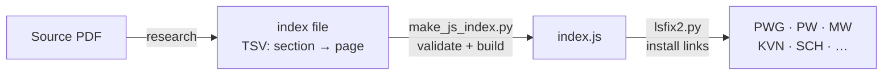
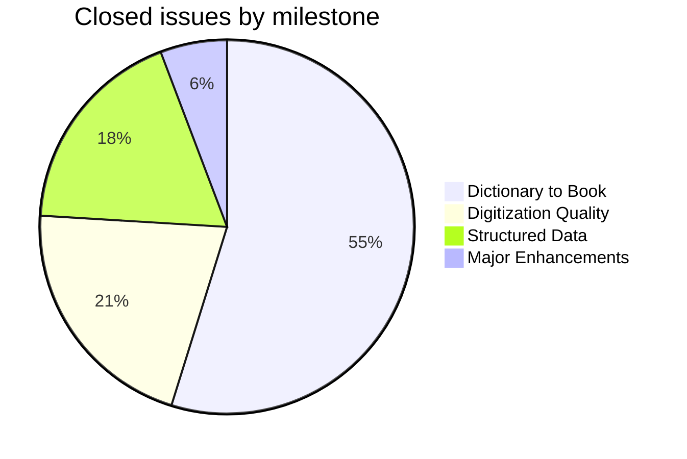
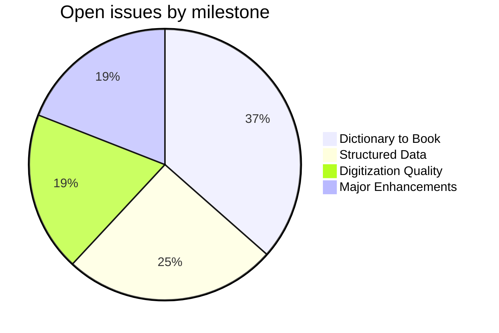

# PWG — Petersburger Wörterbuch

_Created: 17-12-2017 · Last updated: 05-07-2026_

**PWG** (*Sanskrit-Wörterbuch*, Böhtlingk & Roth, 1855–1875) is the large,
seven-volume "Great Petersburg Dictionary" — the foundational Sanskrit–German
lexicon of the 19th century and the direct ancestor of Monier-Williams'
English dictionary. This repository is the correction and enrichment layer
for its Cologne digitisation, part of the [Sanskrit Lexicon](https://github.com/sanskrit-lexicon)
project's [Cologne Digital Sanskrit Dictionaries](https://www.sanskrit-lexicon.uni-koeln.de/)
initiative.

## Why this matters

A scanned 19th-century dictionary is only as useful as its digital text is
trustworthy and its references are followable. PWG cites thousands of
literary sources by abbreviation (`RV.`, `MBH.`, `ŚĀK.`, …) — a scholar
reading an entry needs to click straight through to the actual scanned page
being cited, not just trust a typed reference. This repo's primary,
decade-long effort is building that click-through: turning `<ls>`
(literary-source) abbreviations into validated links to the scanned PDF
edition, alongside the ordinary digitisation work of fixing scan errors,
encoding problems, and markup inconsistencies. A large fraction of that
program is now finished (see Project Timeline below), and it currently feeds
downstream work such as the PWG→Russian translation layer and OCR'd
front-matter editions.

The primary input is `pwg.xml`, maintained in the sibling
[pwgxml](https://github.com/sanskrit-lexicon/pwgxml) repository; corrections
found here are applied across related dictionaries (PW, MW, PWKVN, SCH) since
they share source material and markup conventions.

---

### Directories

| Directory | Contents |
|---|---|
| [`pwg_ls/`](pwg_ls/) | Round 1 — extraction and analysis of `<ls>` (literary source) tags from pwg.xml |
| [`pwg_ls1/`](pwg_ls1/) | Round 2 — authority/bibliography record refinement (begun Dec 2017) |
| [`pwg_ls2/`](pwg_ls2/) | Round 3 — per-source corrections; subfolders named by abbreviation (`RV/`, `ak/`, `mbh1/`, …) |
| [`pwgissues/`](pwgissues/) | One folder per GitHub issue (`issueNNN/` for analysis, `issueNNNfix/` for correction scripts) |
| [`verbs01/`](verbs01/) | Early verb and upasarga analysis against PWG headwords |
| [`verbs01a/`](verbs01a/) | Verb identification correlated with Monier-Williams (MW) dictionary (begun Mar 2020) |
| [`RussianWords/`](RussianWords/) | Russian etymologies in PWG |
| [`pwgheader/`](pwgheader/) | Volume and header metadata |
| [`prefaces/`](prefaces/) | OCR'd front matter (titles, forewords, abbreviation lists, addenda) with EN/RU translations and consolidated single-file editions |
| [`deepseek_pilot/`](deepseek_pilot/) | LLM-assisted pilot over one dictionary slice (translation / literary-source targeting / structural extraction / OCR-diff tracks) — derived artifacts only, source untouched |
| [`misc/`](misc/) | Accent display, encoding conversion, and other utilities |

---

### How It Works

Corrections to `pwg.xml` are never made directly. Instead, scripts produce
**change files** that are applied by `updateByLine.py` (see the org-wide
[csl-orig correction workflow](https://github.com/sanskrit-lexicon/CLAUDE.md)
for the canonical version of this pattern):

```
1234 old original line text
1234 new replacement line text
```

Three operations are supported: `new` (replace), `ins` (insert after), and
`del` (delete). All files must be UTF-8.

#### Issue workflow

Each GitHub issue gets a folder under [`pwgissues/`](pwgissues/):
- `issueNNN/` — analysis scripts, index files, and a `readme.txt` that serves
  as a running log of commands executed and results observed.
- `issueNNNfix/` — correction scripts applied to `pwg.xml` and sibling
  dictionaries (PW, MW, PWKVN, SCH, …). Newer issues may keep everything in
  `issueNNN/`.

#### Link-target workflow

For sources that need clickable page links:
1. Build a tab-separated index file mapping book sections (volume, chapter,
   verse) to PDF page numbers.
2. Run `make_js_index.py` to validate the index and produce `index.js`.
3. Run `lsfix2.py` to rewrite `<ls>` tags across all related dictionaries
   (PWG, PW, MW, etc.) with the link targets.



#### Literary source (`<ls>`) analysis pipeline

Run from `pwg_ls/pwg_dhaval/abbrvwork/`:

```sh
sh makeabbrv.sh
```

This runs: `abbrv.py` → AS→IAST transliteration → `php displayhtml.php` →
`abbrvoutput/display.html` for human review.

**Dependencies:** Python 3, [lxml](https://lxml.de/), PHP

---

### Project Timeline

| Period | Work |
|---|---|
| 2014 | Early experiments — Russian etymologies, accent processing |
| 2015 | Russian words extraction |
| 2016 | Bibliography digitization (`pwgbib`); foundation of literary source analysis |
| 2017 | Abbreviation extraction pipeline (`abbrvwork`); AS→IAST transcoding; `pwg_ls1` begun |
| 2018 | Russian work expanded |
| 2020 | Verb identification (`verbs01a`) correlated with MW verbs |
| 2021 | `pwg_ls2` begun; Rig-Veda `<ls>` markup; VN corrections from Nagabhushana Rao (@Andhrabharati) |
| 2022 | Per-source markup improvements: Spr. (II), AV, P., MBH, Ramayana, AmaraKosha |
| 2023 | Unknown and numeric `<ls>` cleanup |
| 2024 | Link target work: KATHAS, MANU, VN, and many more sources |
| 2025 | Link-splitting (#160) completed for 30+ sources: RAGH., MBH, M., KATHĀS., ŚĀK., TAITTIRĪYA texts, ŚAT. BR., MEGH., MĀLAV., and more; image quality improvements for vol. 6 (#161); additional link targets (#168, #169); automated index checking by Dhaval Patel |
| 2026 H1 | Repository organisation (CLAUDE.md, issue labelling, severity/milestone/project triage; full audit of all 167 issues); AB (Andhrabharati) version reconciliation (#163, #180, #191); PWG front-matter OCR + EN/RU translations shipped ([`prefaces/`](prefaces/)); repo-hygiene pass (structured PR template, changelog v1, Dependabot automerge); a DeepSeek-assisted pilot (translation/link-target/structural-extraction tracks) run over one dictionary slice, then paused mid-scale-up — see [`.ai_state.md`](.ai_state.md) for the exact resume point |

---

### Status (as of 05-07-2026)

Two tracks are currently live, per [`.ai_state.md`](.ai_state.md):

1. **Content/front-matter** — OCR'd German front matter with EN/RU
   translations, published per-page and as consolidated single-file editions
   under [`prefaces/`](prefaces/); most recently committed work.
2. **Markup/link-target** — the long-running `<ls>` program plus the
   Andhrabharati (AB) alternate-digitization merge (`<ab>` tag alignment
   finished at #180; v1 vs v1e diff tracked at #191).

The [`deepseek_pilot/`](deepseek_pilot/) LLM-assisted pilot passed its
go/no-go gate on all three runnable tracks (translate-EN, literary-source
targeting, structural extraction) at limit-20 scale, then began a full
scale-up that was stopped mid-run by the user; it is resumable but not
currently active. It produces derived artifacts only — the canonical
`pwg.xml`/`pwg.txt` source is never touched by it.

---

### Projects & Milestones

Work is organised into four GitHub Projects (org-level kanban boards), each
mirroring a milestone:

| Project | Milestone | Open | Closed | Scope |
|---|---|---|---|---|
| [**Dictionary to Book**](https://github.com/orgs/sanskrit-lexicon/projects/5) | [milestone](https://github.com/sanskrit-lexicon/PWG/milestone/1) | 23 | 57 | Making all literary source abbreviations click-through to scanned source pages — link targets and link splitting |
| [**Structured Data**](https://github.com/orgs/sanskrit-lexicon/projects/7) | [milestone](https://github.com/sanskrit-lexicon/PWG/milestone/3) | 16 | 19 | XML markup normalization, structured data improvements, and resolving interpretation questions |
| [**Digitization Quality**](https://github.com/orgs/sanskrit-lexicon/projects/6) | [milestone](https://github.com/sanskrit-lexicon/PWG/milestone/2) | 12 | 22 | Fixing errors from the original digitization: scan quality, encoding, text corrections, bugs |
| [**Major Enhancements**](https://github.com/orgs/sanskrit-lexicon/projects/8) | [milestone](https://github.com/sanskrit-lexicon/PWG/milestone/4) | 12 | 6 | Large new content additions: Cologne/Andhrabharati material, Weber's Nachlass, verb markup, bibliography |





---

### Labels

Every issue carries one **type** label and one **severity** label.

#### Type

| Label | Meaning |
|---|---|
| `link-target` | Building a click-through from a `<ls>` abbreviation to scanned PDF pages: researching the source, constructing a tab-separated index, and installing links across all related dictionaries |
| `link-splitting` | Combined references like `SOURCE N,N` that resolve to a single target need to be split into individual per-page links |
| `markup` | Normalising the content or structure of XML tags: `<ls>`, `<lex>`, and other elements |
| `text-correction` | Corrections to the German definitions or Sanskrit headwords in the dictionary text |
| `content-enhancement` | Additions that go beyond correction — new material, display upgrades, or structural improvements |
| `encoding` | SLP1/AS/IAST transcoding issues, character rendering (Greek, accents), hyphen/dash normalisation |
| `scan-quality` | Replacing blurry, skewed, or missing scan pages with clearer images |
| `bug` | Broken behaviour in links, XML structure, or download files |
| `question` | Scholarly or editorial questions requiring research before any code change |

#### Severity

| Label | Meaning |
|---|---|
| `minor` | Targeted, self-contained fix — typically a handful of lines or a single file |
| `medium` | Standard unit of work — building one link-target index, a batch of markup corrections, or a moderate content addition |
| `hard` | Large or complex effort spanning many sources, files, or dictionaries |

---

### Contributors

- **Jim Funderburk** ([@funderburkjim](https://github.com/funderburkjim)) — project lead
- **Mārcis Gasūns** ([@gasyoun](https://github.com/gasyoun)) — Russian etymologies, accents, tooling, issue and project organisation
- **Dhaval Patel** ([@drdhaval2785](https://github.com/drdhaval2785)) — automation of link-splitting and index checking
- **Nagabhushana Rao** (@Andhrabharati) — VN text corrections and index data
- **Thomas Malten** — original bibliography digitization (`pwgbib_orig.txt`)

---

_Dr. Mārcis Gasūns_
